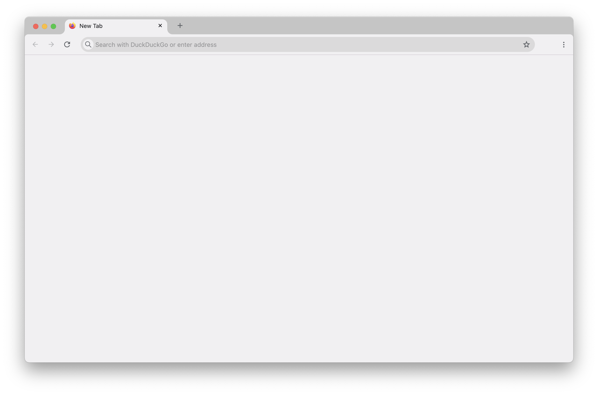
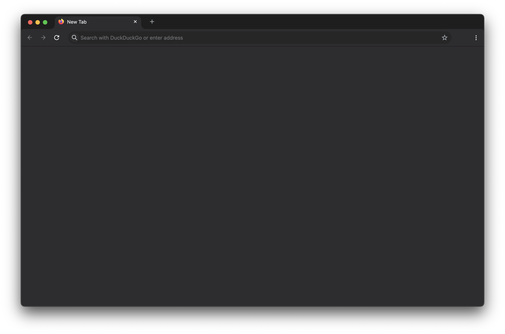

# Material-Fox-Updated-Customization

## tested on macOS

Hi!👋
I'm [d0sse](https://github.com/d0sse) and this is my customization of the firefox theme **[MaterialFox-Updated](https://github.com/edelvarden/material-fox-updated)**.

| Light Version* | Dark Version* |
|---|---|
|||

_**Note:** This setup looks best on macOS_

#### How to install

1. Follow instructions on **[MaterialFox-Updated Readme](https://github.com/M0kh/MaterialFox-Updated?tab=readme-ov-file#recommended-instructions)**
2. replace custom.css file in chrome directory

Enjoy 🎉
